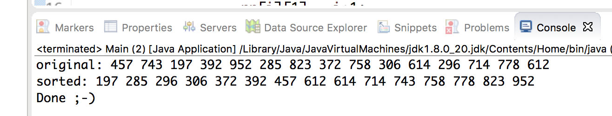

# Radix

The program test the Radix Sort algorithm.

#Instructions

This repository has no branches. You can use the only branch with no restriction.
1. Make sure you have these installed
   
   - [git](http://git-scm.com/)
    
Clone this repository into your local machine using the terminal (mac) or Gitbash (PC)
> git clone https://github.com/crosstown/Worddrag.git

CD to the folder cd worddrag
